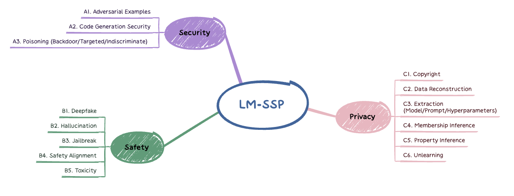

# Introduction 

The resources related to the trustworthiness of large models (LMs) across multiple dimensions (e.g., safety, security, and privacy),                  with a special focus on multi-modal LMs (e.g., vision-language models and diffusion models). 

- This repo is in progress :seedling: (currently manually collected).
- Welcome to recommend resources to us (via                  Issues /  Pull requests /  Email / ...)!
- Badges: 

    - Model:     

    - Comment:                        

   - Venue (Continuous update):  or 

 

# News 

- [2023.01.17] :fire: We collect `108` related papers from [ICLR'24](https://openreview.net/group?id=ICLR.cc/2024/Conference)!
- [2023.01.09] :fire: LM-SSP is released!

# Book

-  [2024/01] **[NIST Trustworthy and Responsible AI Reports](https://nvlpubs.nist.gov/nistpubs/ai/NIST.AI.100-2e2023.pdf)**

# Survey

-  [2024/01] **[TrustLLM: Trustworthiness in Large Language Models](https://arxiv.org/abs/2401.05561)**  
-  [2024/01] **[Risk Taxonomy, Mitigation, and Assessment Benchmarks of Large Language Model Systems](https://arxiv.org/abs/2401.05778)** 
-  [2023/12] **[Privacy Issues in Large Language Models: A Survey](https://arxiv.org/abs/2312.06717)** 
-  [2023/12] **[A Survey on Large Language Model (LLM) Security and Privacy: The Good, the Bad, and the Ugly](https://arxiv.org/abs/2312.02003)** 
-  [2023/10] **[Survey of Vulnerabilities in Large Language Models Revealed by Adversarial Attacks](https://arxiv.org/abs/2310.10844)** 
-  [2023/09] **[AgentBench: Evaluating LLMs as Agents](https://openreview.net/forum?id=zAdUB0aCTQ)**   
-  [2023/08] **[Trustworthy LLMs: A Survey and Guideline for Evaluating Large Language Models' Alignment](https://arxiv.org/abs/2308.05374)** 
-  [2023/07] **[A Comprehensive Overview of Large Language Models](https://arxiv.org/abs/2307.06435)** 
-  [2023/06] **[DecodingTrust: A Comprehensive Assessment of Trustworthiness in GPT Models](https://arxiv.org/abs/2306.11698)**    
-  [2023/05] **[ChatGPT Needs SPADE (Sustainability, PrivAcy, Digital Divide, and Ethics) Evaluation: A Review](https://arxiv.org/abs/2305.03123)** 
-  [2023/04] **[Safety Assessment of Chinese Large Language Models](https://arxiv.org/abs/2304.10436)** 
-  [2023/03] **[A Survey of Large Language Models](https://arxiv.org/abs/2303.18223)** 
-  [2022/11] **[Holistic Evaluation of Language Models](https://arxiv.org/abs/2211.09110)**  
-  [2022/06] **[Beyond the Imitation Game: Quantifying and Extrapolating the Capabilities of Language Models](https://arxiv.org/abs/2206.04615)** 
-  [2021/11] **[Adversarial GLUE: A Multi-Task Benchmark for Robustness Evaluation of Language Models](https://arxiv.org/abs/2111.02840)**  

# Paper

## A. Safety

### A1. Jailbreak

-  [2024/01] **[How Johnny Can Persuade LLMs to Jailbreak Them: Rethinking Persuasion to Challenge AI Safety by Humanizing LLMs](https://arxiv.org/abs/2401.06373)** 
-  [2024/01] **[MLLM-Protector: Ensuring MLLM's Safety Without Hurting Performance](https://arxiv.org/abs/2401.02906)**   
-  [2024/01] **[Intention Analysis Prompting Makes Large Language Models a Good Jailbreak Defender](https://arxiv.org/abs/2401.06561)**  
-  [2023/12] **[A Mutation-Based Method for Multi-Modal Jailbreaking Attack Detection](https://arxiv.org/abs/2312.10766)**  
-  [2023/12] **[Adversarial Attacks on GPT-4 via Simple Random Search](https://www.andriushchenko.me/gpt4adv.pdf)** 
-  [2023/12] **[Make Them Spill the Beans! Coercive Knowledge Extraction From (Production) LLMs](https://arxiv.org/abs/2312.04782)**  
-  [2023/12] **[Safety Alignment in NLP Tasks: Weakly Aligned Summarization as an in-Context Attack](https://arxiv.org/abs/2312.06924)** 
-  [2023/11] **[Evil Geniuses: Delving Into the Safety of LLM-based Agents](https://arxiv.org/abs/2311.11855)**  
-  [2023/11] **[FigStep: Jailbreaking Large Vision-Language Models via Typographic Visual Prompts](https://arxiv.org/abs/2311.05608)**  
-  [2023/11] **[Summon a Demon and Bind It: A Grounded Theory of LLM Red Teaming in the Wild](https://arxiv.org/abs/2311.06237)** 
-  [2023/10] **[Adversarial Attacks on LLMs](https://lilianweng.github.io/posts/2023-10-25-adv-attack-llm/)**  
-  [2023/10] **[AutoDAN: Generating Stealthy Jailbreak Prompts on Aligned Large Language Models](https://arxiv.org/abs/2310.04451)**  
-  [2023/10] **[AutoDAN: Interpretable Gradient-Based Adversarial Attacks on Large Language Models](https://arxiv.org/abs/2310.15140)** 
-  [2023/10] **[Jailbreak and Guard Aligned Language Models With Only Few in-Context Demonstrations](https://arxiv.org/abs/2310.06387)** 
-  [2023/10] **[Jailbreaking Black Box Large Language Models in Twenty Queries](https://arxiv.org/abs/2310.08419)**  
-  [2023/10] **[Low-Resource Languages Jailbreak GPT-4](https://arxiv.org/abs/2310.02446)** 
-  [2023/10] **[SC-Safety: A Multi-Round Open-Ended Question Adversarial Safety Benchmark for Large Language Models in Chinese](https://arxiv.org/abs/2310.05818)**  
-  [2023/10] **[SmoothLLM: Defending Large Language Models Against Jailbreaking Attacks](https://arxiv.org/abs/2310.03684)**  
-  [2023/09] **[GPTFUZZER: Red Teaming Large Language Models With Auto-Generated Jailbreak Prompts](https://arxiv.org/abs/2309.10253)**  
-  [2023/09] **[Open Sesame! Universal Black Box Jailbreaking of Large Language Models](https://arxiv.org/abs/2309.01446)** 
-  [2023/09] **[Defending Against Alignment-Breaking Attacks via Robustly Aligned LLM](https://arxiv.org/abs/2309.14348)**  
-  [2023/09] **[FuzzLLM: A Novel and Universal Fuzzing Framework for Proactively Discovering Jailbreak Vulnerabilities in Large Language Models](https://arxiv.org/abs/2309.05274)** 
-  [2023/09] **[Catastrophic Jailbreak of Open-Source LLMs via Exploiting Generation](https://openreview.net/forum?id=r42tSSCHPh)**   -f1b800)
-  [2023/09] **[Generating Stealthy Jailbreak Prompts on Aligned Large Language Models](https://openreview.net/forum?id=7Jwpw4qKkb)**  
-  [2023/09] **[GPT-4 Is Too Smart to Be Safe: Stealthy Chat With LLMs via Cipher](https://openreview.net/forum?id=MbfAK4s61A)**   
-  [2023/09] **[Jailbreak in Pieces: Compositional Adversarial Attacks on Multi-Modal Language Models](https://openreview.net/forum?id=plmBsXHxgR)**  -f1b800)
-  [2023/09] **[Multilingual Jailbreak Challenges in Large Language Models](https://openreview.net/forum?id=vESNKdEMGp)**  
-  [2023/09] **[On the Humanity of Conversational AI: Evaluating the Psychological Portrayal of LLMs](https://openreview.net/forum?id=H3UayAQWoE)**  -f1b800)
-  [2023/09] **[Safety-Tuned LLaMAs: Lessons From Improving the Safety of Large Language Models That Follow Instructions](https://openreview.net/forum?id=gT5hALch9z)**   
-  [2023/09] **[Understanding Hidden Context in Preference Learning: Consequences for RLHF](https://openreview.net/forum?id=0tWTxYYPnW)**  
-  [2023/08] **[“Do Anything Now”: Characterizing and Evaluating in-the-Wild Jailbreak Prompts on Large Language Models](https://arxiv.org/abs/2308.03825)**  
-  [2023/08] **[Detecting Language Model Attacks With Perplexity](https://arxiv.org/abs/2308.14132)**  
-  [2023/08] **[XSTest: A Test Suite for Identifying Exaggerated Safety Behaviours in Large Language Models](https://arxiv.org/abs/2308.01263)**   
-  [2023/07] **[Jailbroken: How Does LLM Safety Training Fail?](https://arxiv.org/abs/2307.02483)**  
-  [2023/07] **[MasterKey: Automated Jailbreak Across Multiple Large Language Model Chatbots](https://arxiv.org/abs/2307.08715)**  
-  [2023/07] **[Universal and Transferable Adversarial Attacks on Aligned Language Models](https://arxiv.org/abs/2307.15043)**  
-  [2023/07] **[Latent Jailbreak: A Benchmark for Evaluating Text Safety and Output Robustness of Large Language Models](https://arxiv.org/abs/2307.08487)**  
-  [2023/05] **[Jailbreaking ChatGPT via Prompt Engineering: An Empirical Study](https://arxiv.org/abs/2305.13860)** 
-  [2023/05] **[Tricking LLMs Into Disobedience: Understanding, Analyzing, and Preventing Jailbreaks](https://arxiv.org/abs/2305.14965)** 
-  [2023/04] **[Multi-Step Jailbreaking Privacy Attacks on ChatGPT](https://arxiv.org/abs/2304.05197)**  -f1b800)

### A2. Alignment

-  [2024/01] **[Agent Alignment in Evolving Social Norms](https://arxiv.org/abs/2401.04620)**  
-  [2023/12] **[Exploiting Novel GPT-4 APIs](https://arxiv.org/abs/2312.14302)** 
-  [2023/12] **[Alignment for Honesty](https://arxiv.org/abs/2312.07000)** 
-  [2023/11] **[Removing RLHF Protections in GPT-4 via Fine-Tuning](https://arxiv.org/abs/2311.05553)** 
-  [2023/10] **[Shadow Alignment: The Ease of Subverting Safely-Aligned Language Models](https://arxiv.org/abs/2310.02949v1)**  
-  [2023/10] **[AI Alignment: A Comprehensive Survey](https://arxiv.org/abs/2310.19852)**  
-  [2023/09] **[Alignment as Reward-Guided Search](https://openreview.net/forum?id=shgx0eqdw6)**  
-  [2023/09] **[Beyond Imitation: Leveraging Fine-Grained Quality Signals for Alignment](https://openreview.net/forum?id=LNLjU5C5dK)**  
-  [2023/09] **[Beyond Reverse KL: Generalizing Direct Preference Optimization With Diverse Divergence Constraints](https://openreview.net/forum?id=2cRzmWXK9N)**  -f1b800)
-  [2023/09] **[CAS: A Probability-Based Approach for Universal Condition Alignment Score](https://openreview.net/forum?id=E78OaH2s3f)**  -f1b800)
-  [2023/09] **[CPPO: Continual Learning for Reinforcement Learning With Human Feedback](https://openreview.net/forum?id=86zAUE80pP)**  
-  [2023/09] **[Fine-Tuning Aligned Language Models Compromises Safety, Even When Users Do Not Intend To!](https://openreview.net/forum?id=hTEGyKf0dZ)**   -f1b800)
-  [2023/09] **[FLASK: Fine-Grained Language Model Evaluation Based on Alignment Skill Sets](https://openreview.net/forum?id=CYmF38ysDa)**  -f1b800)
-  [2023/09] **[Gaining Wisdom From Setbacks: Aligning Large Language Models via Mistake Analysis](https://openreview.net/forum?id=aA33A70IO6)**  
-  [2023/09] **[Generative Judge for Evaluating Alignment](https://openreview.net/forum?id=gtkFw6sZGS)**  
-  [2023/09] **[Group Preference Optimization: Few-Shot Alignment of Large Language Models](https://openreview.net/forum?id=DpFeMH4l8Q)**  
-  [2023/09] **[Improving Generalization of Alignment With Human Preferences Through Group Invariant Learning](https://openreview.net/forum?id=fwCoLe3TAX)**  -f1b800)
-  [2023/09] **[Large Language Models as Automated Aligners for  Benchmarking  Vision-Language Models](https://openreview.net/forum?id=kZEXgtMNNo)**  
-  [2023/09] **[Peering Through Preferences: Unraveling Feedback Acquisition for Aligning Large Language Models](https://openreview.net/forum?id=dKl6lMwbCy)**  
-  [2023/09] **[RAIN: Your Language Models Can Align Themselves Without Finetuning](https://openreview.net/forum?id=pETSfWMUzy)**  
-  [2023/09] **[RLCD: Reinforcement Learning From Contrastive Distillation for LM Alignment](https://openreview.net/forum?id=v3XXtxWKi6)**  
-  [2023/09] **[Safe RLHF: Safe Reinforcement Learning From Human Feedback](https://openreview.net/forum?id=TyFrPOKYXw)**  -f1b800)
-  [2023/09] **[SALMON: Self-Alignment With Principle-Following Reward Models](https://openreview.net/forum?id=xJbsmB8UMx)**  
-  [2023/09] **[Self-Alignment With Instruction Backtranslation](https://openreview.net/forum?id=1oijHJBRsT)**  -f1b800)
-  [2023/09] **[Statistical Rejection Sampling Improves Preference Optimization](https://openreview.net/forum?id=xbjSwwrQOe)**  
-  [2023/09] **[True Knowledge Comes From Practice: Aligning Large Language Models With Embodied Environments via Reinforcement Learning](https://openreview.net/forum?id=hILVmJ4Uvu)**  
-  [2023/09] **[Urial: Aligning Untuned LLMs With Just the 'Write' Amount of in-Context Learning](https://openreview.net/forum?id=wxJ0eXwwda)**  
-  [2023/09] **[What Happens When You Fine-Tuning Your Model? Mechanistic Analysis of Procedurally Generated Tasks.](https://openreview.net/forum?id=A0HKeKl4Nl)**  
-  [2023/09] **[What Makes Good Data for Alignment? A Comprehensive Study of Automatic Data Selection in Instruction Tuning](https://openreview.net/forum?id=BTKAeLqLMw)**  
-  [2023/07] **[BeaverTails: Towards Improved Safety Alignment of LLM via a Human-Preference Dataset](https://arxiv.org/abs/2307.04657)** 
-  [2023/07] **[CValues: Measuring the Values of Chinese Large Language Models From Safety to Responsibility](https://arxiv.org/abs/2307.09705)**  
-  [2023/05] **[Principle-Driven Self-Alignment of Language Models From Scratch With Minimal Human Supervision](https://arxiv.org/abs/2305.03047)** 
-  [2023/04] **[Fundamental Limitations of Alignment in Large Language Models](https://arxiv.org/abs/2304.11082)** 
-  [2023/04] **[RAFT: Reward rAnked FineTuning for Generative Foundation Model Alignment](https://arxiv.org/abs/2304.06767)** 
-  [2022/10] **[Enabling Classifiers to Make Judgements Explicitly Aligned With Human Values](https://arxiv.org/abs/2210.07652)** 

### A3. Deepfake

-  [2024/01] **[Few-Shot Detection of Machine-Generated Text Using Style Representations](https://arxiv.org/abs/2401.06712)** 
-  [2024/01] **[LLM-as-a-Coauthor: The Challenges of Detecting LLM-Human Mixcase](https://arxiv.org/abs/2401.05952)**  
-  [2024/01] **[Authorship Obfuscation in Multilingual Machine-Generated Text Detection](https://arxiv.org/abs/2401.07867)**  
-  [2023/10] **[Harnessing the Power of ChatGPT in Fake News: An in-Depth Exploration in Generation, Detection and Explanation](https://arxiv.org/abs/2310.05046)** 
-  [2023/09] **[Can LLM-Generated Misinformation Be Detected?](https://openreview.net/forum?id=ccxD4mtkTU)**  
-  [2023/09] **[Detecting Machine-Generated Texts by Multi-Population Aware Optimization for Maximum Mean Discrepancy](https://openreview.net/forum?id=3fEKavFsnv)**  
-  [2023/09] **[Robustness of AI-Image Detectors: Fundamental Limits and Practical Attacks](https://openreview.net/forum?id=dLoAdIKENc)**  
-  [2023/05] **[Evading Watermark Based Detection of AI-Generated Content](https://arxiv.org/abs/2305.03807)**  
-  [2023/05] **[On the Risk of Misinformation Pollution With Large Language Models](https://arxiv.org/abs/2305.13661)**  -f1b800)
-  [2023/04] **[Synthetic Lies: Understanding AI-Generated Misinformation and Evaluating Algorithmic and Human Solutions](https://doi.org/10.1145/3544548.3581318)**  
-  [2023/03] **[Can AI-Generated Text Be Reliably Detected?](https://arxiv.org/abs/2303.11156)** 
-  [2023/03] **[MGTBench: Benchmarking Machine-Generated Text Detection](https://arxiv.org/abs/2303.14822)**  
-  [2022/12] **[CoCo: Coherence-Enhanced Machine-Generated Text Detection Under Data Limitation With Contrastive Learning](https://arxiv.org/abs/2212.10341)** 
-  [2022/12] **[Discovering Language Model Behaviors With Model-Written Evaluations](https://arxiv.org/abs/2212.09251)**  -f1b800)
-  [2022/10] **[DE-FAKE: Detection and Attribution of Fake Images Generated by Text-to-Image Generation Models](https://arxiv.org/abs/2210.06998)**  

### A4. Ethics
-  [1023/12] **[Exploiting Cultural Biases via Homoglyphs in Text-to-Image Synthesis](https://arxiv.org/abs/2209.08891)**  
-  [2023/12] **[Disentangling Perceptions of Offensiveness: Cultural and Moral Correlates](https://arxiv.org/abs/2312.06861)** 
-  [2023/10] **[Unpacking the Ethical Value Alignment in Big Models](https://arxiv.org/abs/2310.17551)** 
-  [2023/09] **[Denevil: Towards Deciphering and Navigating the Ethical Values of Large Language Models via Instruction Learning](https://openreview.net/forum?id=m3RRWWFaVe)**  
-  [2023/05] **[From Text to MITRE Techniques: Exploring the Malicious Use of Large Language Models for Generating Cyber Attack Payloads](https://arxiv.org/abs/2305.15336)** 
-  [2023/01] **[Exploring AI Ethics of ChatGPT: A Diagnostic Analysis](https://arxiv.org/abs/2301.12867)** 

### A5. Fairness

-  [2024/01] **[Beyond the Surface: A Global-Scale Analysis of Visual Stereotypes in Text-to-Image Generation](https://arxiv.org/abs/2401.06310)** 
-  [2023/12] **[GPTBIAS: A Comprehensive Framework for Evaluating Bias in Large Language Models](https://arxiv.org/abs/2312.06315)** 
-  [2023/11] **[Beyond Detection: Unveiling Fairness Vulnerabilities in Abusive Language Models](https://arxiv.org/abs/2311.09428)** 
-  [2023/11] **[FFT: Towards Harmlessness Evaluation and Analysis for LLMs With Factuality, Fairness, Toxicity](https://arxiv.org/abs/2311.18580)** 
-  [2023/11] **[ROBBIE: Robust Bias Evaluation of Large Generative Language Models](https://arxiv.org/abs/2311.18140)**  
-  [2023/10] **[Im Not Racist But...: Discovering Bias in the Internal Knowledge of Large Language Models](https://arxiv.org/abs/2310.08780)** 
-  [2023/10] **[Investigating the Fairness of Large Language Models for Predictions on Tabular Data](https://arxiv.org/abs/2310.14607)** 
-  [2023/10] **[Kelly Is a Warm Person, Joseph Is a Role Model: Gender Biases in LLM-Generated Reference Letters](https://arxiv.org/abs/2310.09219)**  -f1b800)
-  [2023/09] **[Bias and Fairness in Chatbots: An Overview](https://arxiv.org/abs/2309.08836)** 
-  [2023/09] **[Bias and Fairness in Large Language Models: A Survey](https://arxiv.org/abs/2309.00770)** 
-  [2023/09] **[People's Perceptions Toward Bias and Related Concepts in Large Language Models: A Systematic Review](https://arxiv.org/abs/2309.14504)** 
-  [2023/09] **[Achieving Fairness in Multi-Agent MDP Using Reinforcement Learning](https://openreview.net/forum?id=yoVq2BGQdP)**   
-  [2023/09] **[Bias Runs Deep: Implicit Reasoning Biases in Persona-Assigned LLMs](https://openreview.net/forum?id=kGteeZ18Ir)**  
-  [2023/09] **[FairVLM: Mitigating Bias in Pre-Trained Vision-Language Models](https://openreview.net/forum?id=HXoq9EqR9e)**  
-  [2023/09] **[Finetuning Text-to-Image Diffusion Models for Fairness](https://openreview.net/forum?id=hnrB5YHoYu)**  -f1b800)
-  [2023/09] **[The Devil Is in the Neurons: Interpreting and Mitigating Social Biases in Language Models](https://openreview.net/forum?id=SQGUDc9tC8)**  
-  [2023/08] **[FairBench: A Four-Stage Automatic Framework for Detecting Stereotypes and Biases in Large Language Models](https://arxiv.org/abs/2308.10397)** 
-  [2023/08] **[Gender Bias and Stereotypes in Large Language Models](https://arxiv.org/abs/2308.14921)**  
-  [2023/07] **[Queer People Are People First: Deconstructing Sexual Identity Stereotypes in Large Language Models](https://arxiv.org/abs/2307.00101)** 
-  [2023/06] **[Knowledge of Cultural Moral Norms in Large Language Models](https://arxiv.org/abs/2306.01857)**  
-  [2023/06] **[WinoQueer: A Community-in-the-Loop Benchmark for Anti-Lgbtq+ Bias in Large Language Models](https://arxiv.org/abs/2306.15087)**  
-  [2023/05] **[BiasAsker: Measuring the Bias in Conversational AI System](https://arxiv.org/abs/2305.12434)**  
-  [2023/05] **[Is ChatGPT Fair for Recommendation? Evaluating Fairness in Large Language Model Recommendation](https://arxiv.org/abs/2305.07609)**   
-  [2023/05] **[Large Language Models Are Not Fair Evaluators](https://arxiv.org/abs/2305.17926)**  
-  [2023/05] **[Uncovering and Quantifying Social Biases in Code Generation](https://arxiv.org/abs/2305.15377)**  
-  [2022/09] **[Moral Mimicry: Large Language Models Produce Moral Rationalizations Tailored to Political Identity](https://arxiv.org/abs/2209.12106)**  -f1b800)
-  [2022/05] **[Auto-Debias: Debiasing Masked Language Models With Automated Biased Prompts](https://aclanthology.org/2022.acl-long.72/)**    
-  [2022/03] **[Mitigating Gender Bias in Distilled Language Models via Counterfactual Role Reversal](https://arxiv.org/abs/2203.12574)**  -f1b800)
-  [2021/04] **[Mitigating Political Bias in Language Models Through Reinforced Calibration](https://arxiv.org/abs/2104.14795)**  
-  [2021/02] **[Bias Out-of-the-Box: An Empirical Analysis of Intersectional Occupational Biases in Popular Generative Language Models](https://arxiv.org/abs/2102.04130)**  
-  [2021/01] **[Persistent Anti-Muslim Bias in Large Language Models](https://arxiv.org/abs/2101.05783)**  

### A6. Hallucination

-  [2024/01] **[Seven Failure Points When Engineering a Retrieval Augmented Generation System](https://arxiv.org/abs/2401.05856)**  
-  [2024/01] **[Relying on the Unreliable: The Impact of Language Models' Reluctance to Express Uncertainty](https://arxiv.org/abs/2401.06730)** 
-  [2024/01] **[Model Editing Can Hurt General Abilities of Large Language Models](https://arxiv.org/abs/2401.04700)**  
-  [2023/12] **[The Earth Is Flat Because...: Investigating LLMs' Belief Towards Misinformation via Persuasive Conversation](https://arxiv.org/abs/2312.09085)** 
-  [2023/12] **[DelucionQA: Detecting Hallucinations in Domain-Specific Question Answering](https://arxiv.org/abs/2312.05200)**  -f1b800)
-  [2023/12] **[Improving Factual Error Correction by Learning to Inject Factual Errors](https://arxiv.org/abs/2312.07049)** 
-  [2023/12] **[RLHF-V: Towards Trustworthy MLLMs via Behavior Alignment From Fine-Grained Correctional Human Feedback](https://arxiv.org/abs/2312.00849)** 
-  [2023/11] **[Calibrated Language Models Must Hallucinate](https://arxiv.org/abs/2311.14648)** 
-  [2023/11] **[A Survey on Hallucination in Large Language Models: Principles, Taxonomy, Challenges, and Open Questions](https://arxiv.org/abs/2311.05232)** 
-  [2023/11] **[Chain-of-Note: Enhancing Robustness in Retrieval-Augmented Language Models](https://arxiv.org/abs/2311.09210)** 
-  [2023/11] **[Deficiency of Large Language Models in Finance: An Empirical Examination of Hallucination](https://arxiv.org/abs/2311.15548)** 
-  [2023/11] **[Enhancing Uncertainty-Based Hallucination Detection With Stronger Focus](https://arxiv.org/abs/2311.13230)**  
-  [2023/11] **[Holistic Analysis of Hallucination in GPT-4V(ision): Bias and Interference Challenges](https://arxiv.org/abs/2311.03287)** 
-  [2023/11] **[Mitigating Large Language Model Hallucinations via Autonomous Knowledge Graph-Based Retrofitting](https://arxiv.org/abs/2311.13314)** 
-  [2023/11] **[UHGEval: Benchmarking the Hallucination of Chinese Large Language Models via Unconstrained Generation](https://arxiv.org/abs/2311.15296)**  
-  [2023/11] **[When Large Language Models Contradict Humans? Large Language Models' Sycophantic Behaviour](https://arxiv.org/abs/2311.09410)** 
-  [2023/10] **[Explainable Claim Verification via Knowledge-Grounded Reasoning With Large Language Models](https://arxiv.org/abs/2310.05253)**  -f1b800)
-  [2023/10] **[Survey on Factuality in Large Language Models: Knowledge, Retrieval and Domain-Specificity](https://arxiv.org/abs/2310.07521)** 
-  [2023/09] **[Siren's Song in the AI Ocean: A Survey on Hallucination in Large Language Models](https://arxiv.org/abs/2309.01219)** 
-  [2023/09] **[Analyzing and Mitigating Object Hallucination in Large Vision-Language Models](https://openreview.net/forum?id=oZDJKTlOUe)**  
-  [2023/09] **[Beyond Task Performance: Evaluating and Reducing the Flaws of Large Multimodal Models With in-Context-Learning](https://openreview.net/forum?id=mMaQvkMzDi)**  
-  [2023/09] **[BTR: Binary Token Representations for Efficient Retrieval Augmented Language Models](https://openreview.net/forum?id=3TO3TtnOFl)**   -f1b800)
-  [2023/09] **[Chain-of-Knowledge: Grounding Large Language Models via Dynamic Knowledge Adapting Over Heterogeneous Sources](https://openreview.net/forum?id=cPgh4gWZlz)**  
-  [2023/09] **[Chain-of-Table: Evolving Tables in the Reasoning Chain for Table Understanding](https://openreview.net/forum?id=4L0xnS4GQM)**  
-  [2023/09] **[Compressing LLMs: The Truth Is Rarely Pure and Never Simple](https://openreview.net/forum?id=B9klVS7Ddk)**  
-  [2023/09] **[Conformal Language Modeling](https://openreview.net/forum?id=pzUhfQ74c5)**  
-  [2023/09] **[CRITIC: Large Language Models Can Self-Correct With Tool-Interactive Critiquing](https://openreview.net/forum?id=Sx038qxjek)**  
-  [2023/09] **[Davidsonian Scene Graph: Improving Reliability in Fine-Grained Evaluation for Text-Image Generation](https://openreview.net/forum?id=ITq4ZRUT4a)**  
-  [2023/09] **[Do Large Language Models Know About Facts?](https://openreview.net/forum?id=9OevMUdods)**  -f1b800)
-  [2023/09] **[DoLa: Decoding by Contrasting Layers Improves Factuality in Large Language Models](https://openreview.net/forum?id=Th6NyL07na)**  
-  [2023/09] **[Ferret: Refer and Ground Anything Anywhere at Any Granularity](https://openreview.net/forum?id=2msbbX3ydD)**  -f1b800)
-  [2023/09] **[Fine-Tuning Language Models for Factuality](https://openreview.net/forum?id=WPZ2yPag4K)**  
-  [2023/09] **[INSIDE: LLMs' Internal States Retain the Power of Hallucination Detection](https://openreview.net/forum?id=Zj12nzlQbz)**  
-  [2023/09] **[Lightweight Language Model Calibration for Open-Ended Question Answering With Varied Answer Lengths](https://openreview.net/forum?id=jH67LHVOIO)**  
-  [2023/09] **[MetaGPT: Meta Programming for Multi-Agent Collaborative Framework](https://openreview.net/forum?id=VtmBAGCN7o)**   -f1b800)
-  [2023/09] **[Mitigating Hallucination in Large Multi-Modal Models via Robust Instruction Tuning](https://openreview.net/forum?id=J44HfH4JCg)**  
-  [2023/09] **[RAPPER: Reinforced Rationale-Prompted Paradigm for Natural Language Explanation in Visual Question Answering](https://openreview.net/forum?id=bshfchPM9H)**  
-  [2023/09] **[Reasoning on Graphs: Faithful and Interpretable Large Language Model Reasoning](https://openreview.net/forum?id=ZGNWW7xZ6Q)**  
-  [2023/09] **[Self-Contradictory Hallucinations of Large Language Models: Evaluation, Detection and Mitigation](https://openreview.net/forum?id=EmQSOi1X2f)**  
-  [2023/09] **[Supervised Knowledge Makes Large Language Models Better in-Context Learners](https://openreview.net/forum?id=bAMPOUF227)**  
-  [2023/09] **[Teaching Language Models to Hallucinate Less With Synthetic Tasks](https://openreview.net/forum?id=xpw7V0P136)**  
-  [2023/09] **[Teaching Large Language Models to Self-Debug](https://openreview.net/forum?id=KuPixIqPiq)**  
-  [2023/09] **[The Reasonableness Behind Unreasonable Translation Capability of Large Language Model](https://openreview.net/forum?id=3KDbIWT26J)**  
-  [2023/09] **[Think-on-Graph: Deep and Responsible Reasoning of Large Language Model on Knowledge Graph](https://openreview.net/forum?id=nnVO1PvbTv)**  
-  [2023/09] **[Unveiling and Manipulating Prompt Influence in Large Language Models](https://openreview.net/forum?id=ap1ByuwQrX)**  
-  [2023/08] **[Simple Synthetic Data Reduces Sycophancy in Large Language Models](https://arxiv.org/abs/2308.03958)** 
-  [2023/07] **[A Stitch in Time Saves Nine: Detecting and Mitigating Hallucinations of LLMs by Validating Low-Confidence Generation](https://arxiv.org/abs/2307.03987)** 
-  [2023/07] **[Shifting Attention to Relevance: Towards the Uncertainty Estimation of Large Language Models](https://arxiv.org/abs/2307.01379)**  
-  [2023/06] **[Explore, Establish, Exploit: Red Teaming Language Models From Scratch](https://arxiv.org/abs/2306.09442)** 
-  [2023/06] **[Inference-Time Intervention: Eliciting Truthful Answers From a Language Model](https://arxiv.org/abs/2306.03341)** 
-  [2023/05] **[Fact-Checking Complex Claims With Program-Guided Reasoning](https://arxiv.org/abs/2305.12744)**  
-  [2023/05] **[HaluEval: A Large-Scale Hallucination Evaluation Benchmark for Large Language Models](https://arxiv.org/abs/2305.11747)**  
-  [2023/05] **[Improving Factuality and Reasoning in Language Models Through Multiagent Debate](https://arxiv.org/abs/2305.14325)** 
-  [2023/05] **[Knowledge of Knowledge: Exploring Known-Unknowns Uncertainty With Large Language Models](https://arxiv.org/abs/2305.13712)** 
-  [2023/05] **[Mitigating Language Model Hallucination With Interactive Question-Knowledge Alignment](https://arxiv.org/abs/2305.13669)** 
-  [2023/05] **[Sources of Hallucination by Large Language Models on Inference Tasks](https://arxiv.org/abs/2305.14552)**  -f1b800)
-  [2023/05] **[Trusting Your Evidence: Hallucinate Less With Context-Aware Decoding](https://arxiv.org/abs/2305.14739)** 
-  [2023/04] **[In ChatGPT We Trust? Measuring and Characterizing the Reliability of ChatGPT](https://arxiv.org/abs/2304.08979)** 
-  [2023/03] **[SelfCheckGPT: Zero-Resource Black-Box Hallucination Detection for Generative Large Language Models](https://arxiv.org/abs/2303.08896)**  
-  [2023/02] **[A Categorical Archive of ChatGPT Failures](https://arxiv.org/abs/2302.03494)** 
-  [2023/02] **[Check Your Facts and Try Again: Improving Large Language Models With External Knowledge and Automated Feedback](https://arxiv.org/abs/2302.12813)**  
-  [2022/02] **[Locating and Editing Factual Associations in GPT](https://arxiv.org/abs/2202.05262)**  
-  [2022/02] **[Survey of Hallucination in Natural Language Generation](https://arxiv.org/abs/2202.03629)** 

### A7. Toxicity

-  [2024/01] **[A Mechanistic Understanding of Alignment Algorithms: A Case Study on DPO and Toxicity](https://arxiv.org/abs/2401.01967)** 
-  [2024/01] **[MetaHate: A Dataset for Unifying Efforts on Hate Speech Detection](https://arxiv.org/abs/2401.06526)**  
-  [2023/12] **[Efficient Toxic Content Detection by Bootstrapping and Distilling Large Language Models](https://arxiv.org/abs/2312.08303)** 
-  [2023/12] **[GTA: Gated Toxicity Avoidance for LM Performance Preservation](https://arxiv.org/abs/2312.06122)**  -f1b800)
-  [2023/12] **[Llama Guard: LLM-based Input-Output Safeguard for Human-Ai Conversations](https://arxiv.org/abs/2312.06674)**  
-  [2023/11] **[Unveiling the Implicit Toxicity in Large Language Models](https://arxiv.org/abs/2311.17391)**  
-  [2023/10] **[On the Proactive Generation of Unsafe Images From Text-to-Image Models Using Benign Prompts](https://arxiv.org/abs/2310.16613)** 
-  [2023/10] **[All Languages Matter: On the Multilingual Safety of Large Language Models](https://arxiv.org/abs/2310.00905)** 
-  [2023/09] **[(InThe)WildChat: 570K ChatGPT Interaction Logs in the Wild](https://openreview.net/forum?id=Bl8u7ZRlbM)**   -f1b800)
-  [2023/09] **[Controlled Text Generation via Language Model Arithmetic](https://openreview.net/forum?id=SLw9fp4yI6)**  -f1b800)
-  [2023/09] **[Curiosity-Driven Red-Teaming for Large Language Models](https://openreview.net/forum?id=4KqkizXgXU)**  
-  [2023/09] **[RealChat-1M: A Large-Scale Real-World LLM Conversation Dataset](https://openreview.net/forum?id=BOfDKxfwt0)**   -f1b800)
-  [2023/09] **[Understanding Catastrophic Forgetting in Language Models via Implicit Inference](https://openreview.net/forum?id=VrHiF2hsrm)**  
-  [2023/09] **[Unmasking and Improving Data Credibility: A Study With Datasets for Training Harmless Language Models](https://openreview.net/forum?id=6bcAD6g688)**  
-  [2023/09] **[What's in My Big Data?](https://openreview.net/forum?id=RvfPnOkPV4)**  -f1b800)
-  [2023/08] **[You Only Prompt Once: On the Capabilities of Prompt Learning on Large Language Models to Tackle Toxic Content](https://arxiv.org/abs/2308.05596)**  
-  [2023/08] **[Do-Not-Answer: A Dataset for Evaluating Safeguards in LLMs](https://arxiv.org/abs/2308.13387)** 
-  [2023/05] **[Unsafe Diffusion: On the Generation of Unsafe Images and Hateful Memes From Text-to-Image Models](https://arxiv.org/abs/2305.13873)**  
-  [2023/05] **[Evaluating ChatGPT's Performance for Multilingual and Emoji-Based Hate Speech Detection](https://arxiv.org/abs/2305.13276)** 
-  [2023/04] **[Toxicity in ChatGPT: Analyzing Persona-Assigned Language Models](https://arxiv.org/abs/2304.05335)**  -f1b800)
-  [2023/02] **[Adding Instructions During Pretraining: Effective Way of Controlling Toxicity in Language Models](https://arxiv.org/abs/2302.07388)**  
-  [2023/02] **[Is ChatGPT Better Than Human Annotators? Potential and Limitations of ChatGPT in Explaining Implicit Hate Speech](https://arxiv.org/abs/2302.07736)**  -f1b800)
-  [2022/12] **[Constitutional AI: Harmlessness From AI Feedback](https://arxiv.org/abs/2212.08073)** 
-  [2022/12] **[On Second Thought, Let's Not Think Step by Step! Bias and Toxicity in Zero-Shot Reasoning](https://arxiv.org/abs/2212.08061)**  
-  [2022/10] **[Unified Detoxifying and Debiasing in Language Generation via Inference-Time Adaptive Optimization](https://arxiv.org/abs/2210.04492)**  
-  [2022/05] **[Toxicity Detection With Generative Prompt-Based Inference](https://arxiv.org/abs/2205.12390)** 
-  [2022/04] **[Training a Helpful and Harmless Assistant With Reinforcement Learning From Human Feedback](https://arxiv.org/abs/2204.05862)** 
-  [2022/03] **[ToxiGen: A Large-Scale Machine-Generated Dataset for Adversarial and Implicit Hate Speech Detection](https://arxiv.org/abs/2203.09509)**  
-  [2020/09] **[RealToxicityPrompts: Evaluating Neural Toxic Degeneration in Language Models](https://arxiv.org/abs/2009.11462)**   -f1b800)

## B. Security

### B1. Adversarial Examples

-  [2024/01] **[INSTRUCTTA: Instruction-Tuned Targeted Attack for Large Vision-Language Models](https://arxiv.org/abs/2312.01886)** 
-  [2024/01] **[Adversarial Examples Are Misaligned in Diffusion Model Manifolds](https://arxiv.org/abs/2401.06637)** 
-  [2024/01] **[Exploring Adversarial Attacks Against Latent Diffusion Model From the Perspective of Adversarial Transferability](https://arxiv.org/abs/2401.07087)** 
-  [2023/12] **[Causality Analysis for Evaluating the Security of Large Language Models](https://arxiv.org/abs/2312.07876)** 
-  [2023/12] **[Hijacking Context in Large Multi-Modal Models](https://arxiv.org/abs/2312.07553)** 
-  [2023/11] **[Can Protective Perturbation Safeguard Personal Data From Being Exploited by Stable Diffusion?](https://arxiv.org/abs/2312.00084)**  
-  [2023/11] **[DiffAttack: Evasion Attacks Against Diffusion-Based Adversarial Purification](https://arxiv.org/abs/2311.16124)**   
-  [2023/11] **[How Many Unicorns Are in This Image? A Safety Evaluation Benchmark for Vision LLMs](https://arxiv.org/abs/2311.16101)**   
-  [2023/11] **[Unveiling Safety Vulnerabilities of Large Language Models](https://arxiv.org/abs/2311.04124)** 
-  [2023/10] **[Misusing Tools in Large Language Models With Visual Adversarial Examples](https://arxiv.org/abs/2310.03185)** 
-  [2023/09] **[How Robust Is Google's Bard to Adversarial Image Attacks?](https://arxiv.org/abs/2309.11751)**  
-  [2023/09] **[Image Hijacks: Adversarial Images Can Control Generative Models at Runtime](https://arxiv.org/abs/2309.00236)**  
-  [2023/09] **[An Image Is Worth 1000 Lies: Transferability of Adversarial Images Across Prompts on Vision-Language Models](https://openreview.net/forum?id=nc5GgFAvtk)**  -f1b800)
-  [2023/09] **[An LLM Can Fool Itself: A Prompt-Based Adversarial Attack](https://openreview.net/forum?id=VVgGbB9TNV)**  
-  [2023/09] **[Language Model Detectors Are Easily Optimized Against](https://openreview.net/forum?id=4eJDMjYZZG)**  
-  [2023/09] **[Leveraging Optimization for Adaptive Attacks on Image Watermarks](https://openreview.net/forum?id=O9PArxKLe1)**  
-  [2023/09] **[Tensor Trust: Interpretable Prompt Injection Attacks From an Online Game](https://openreview.net/forum?id=fsW7wJGLBd)**   -f1b800)
-  [2023/09] **[Training Socially Aligned Language Models on Simulated Social Interactions](https://openreview.net/forum?id=NddKiWtdUm)**   
-  [2023/08] **[Ceci N'est Pas Une Pomme: Adversarial Illusions in Multi-Modal Embeddings](https://arxiv.org/abs/2308.11804)**  
-  [2023/08] **[On the Adversarial Robustness of Multi-Modal Foundation Models](https://arxiv.org/abs/2308.10741)**  -f1b800)
-  [2023/08] **[Robustness Over Time: Understanding Adversarial Examples' Effectiveness on Longitudinal Versions of Large Language Models](https://arxiv.org/abs/2308.07847)** 
-  [2023/07] **[Certified Robustness for Large Language Models With Self-Denoising](https://arxiv.org/abs/2307.07171)**  
-  [2023/06] **[Adversarial Examples in the Age of ChatGPT](http://spylab.ai/blog/chatbot-adversarial-examples/)**  
-  [2023/06] **[Are Aligned Neural Networks Adversarially Aligned?](https://arxiv.org/abs/2306.15447)**  
-  [2023/06] **[PromptBench: Towards Evaluating the Robustness of Large Language Models on Adversarial Prompts](https://arxiv.org/abs/2306.04528)**  
-  [2023/06] **[Stable Diffusion Is Unstable](https://arxiv.org/abs/2306.02583)**  
-  [2023/06] **[Unlearnable Examples for Diffusion Models: Protect Data From Unauthorized Exploitation](https://arxiv.org/abs/2306.01902)**  
-  [2023/06] **[Visual Adversarial Examples Jailbreak Large Language Models](https://arxiv.org/abs/2306.13213)**  
-  [2023/05] **[On Evaluating Adversarial Robustness of Large Vision-Language Models](https://arxiv.org/abs/2305.16934)**   
-  [2023/05] **[Assessing Hidden Risks of LLMs: An Empirical Study on Robustness, Consistency, and Credibility](https://arxiv.org/abs/2305.10235)** 
-  [2023/03] **[Anti-DreamBooth: Protecting Users From Personalized Text-to-Image Synthesis](https://arxiv.org/abs/2303.15433)**   
-  [2023/02] **[Adversarial Example Does Good: Preventing Painting Imitation From Diffusion Models via Adversarial Examples](https://arxiv.org/abs/2302.04578)**   
-  [2023/02] **[Raising the Cost of Malicious AI-Powered Image Editing](https://arxiv.org/abs/2302.06588)**   
-  [2023/02] **[Large Language Models Can Be Easily Distracted by Irrelevant Context](https://arxiv.org/abs/2302.00093)**  
-  [2023/02] **[Not What You've Signed Up For: Compromising Real-World LLM-Integrated Applications With Indirect Prompt Injection](https://arxiv.org/abs/2302.12173v2)**   
-  [2023/02] **[On the Robustness of ChatGPT: An Adversarial and Out-of-Distribution Perspective](https://arxiv.org/abs/2302.12095)** 
-  [2023/01] **[On Robustness of Prompt-Based Semantic Parsing With Large Pre-Trained Language Model: An Empirical Study on Codex](https://arxiv.org/abs/2301.12868)**   
-  [2022/12] **[Understanding Zero-Shot Adversarial Robustness for Large-Scale Model](https://arxiv.org/abs/2212.07016)**   

### B2. Poisoning 

-  [2024/01] **[Sleeper Agents: Training Deceptive LLMs That Persist Through Safety Training](https://arxiv.org/abs/2401.05566)**  
-  [2024/01] **[Universal Vulnerabilities in Large Language Models: In-Context Learning Backdoor Attacks](https://arxiv.org/abs/2401.05949)**  
-  [2023/12] **[Leveraging Diffusion-Based Image Variations for Robust Training on Poisoned Data](https://arxiv.org/abs/2310.06372)**  
-  [2023/12] **[Unleashing Cheapfakes Through Trojan Plugins of Large Language Models](https://arxiv.org/abs/2312.00374)** 
-  [2023/12] **[Poisoned ChatGPT Finds Work for Idle Hands: Exploring Developers' Coding Practices With Insecure Suggestions From Poisoned AI Models](https://arxiv.org/abs/2312.06227)** 
-  [2023/12] **[Stealthy and Persistent Unalignment on Large Language Models via Backdoor Injections](https://arxiv.org/abs/2312.00027)** 
-  [2023/11] **[Test-Time Backdoor Mitigation for Black-Box Large Language Models With Defensive Demonstrations](https://arxiv.org/abs/2311.09763)**  
-  [2023/10] **[Rickrolling the Artist: Injecting Backdoors into Text Encoders for Text-to-Image Synthesis](https://arxiv.org/abs/2211.02408)**  
-  [2023/10] **[Composite Backdoor Attacks Against Large Language Models](https://arxiv.org/abs/2310.07676)** 
-  [2023/10] **[Large Language Models Are Better Adversaries: Exploring Generative Clean-Label Backdoor Attacks Against Text Classifiers](https://arxiv.org/abs/2310.18603)**  -f1b800)
-  [2023/10] **[PoisonPrompt: Backdoor Attack on Prompt-Based Large Language Models](https://arxiv.org/abs/2310.12439)**   
-  [2023/10] **[Prompt Injection Attacks and Defenses in LLM-Integrated Applications](https://arxiv.org/abs/2310.12815)**   
-  [2023/10] **[Prompt-Specific Poisoning Attacks on Text-to-Image Generative Models](https://arxiv.org/abs/2310.13828)** 
-  [2023/09] **[BadChain: Backdoor Chain-of-Thought Prompting for Large Language Models](https://openreview.net/forum?id=c93SBwz1Ma)**  
-  [2023/09] **[BadEdit: Backdooring Large Language Models by Model Editing](https://openreview.net/forum?id=duZANm2ABX)**  
-  [2023/09] **[Universal Jailbreak Backdoors From Poisoned Human Feedback](https://openreview.net/forum?id=GxCGsxiAaK)**  
-  [2023/08] **[LMSanitator: Defending Prompt-Tuning Against Task-Agnostic Backdoors](https://arxiv.org/abs/2308.13904)**   
-  [2023/08] **[The Poison of Alignment](https://arxiv.org/abs/2308.13449)** 
-  [2023/07] **[Backdooring Instruction-Tuned Large Language Models With Virtual Prompt Injection](https://arxiv.org/abs/2307.16888)**  
-  [2023/06] **[On the Exploitability of Instruction Tuning](https://arxiv.org/abs/2306.17194)**   
-  [2023/06] **[Prompt Injection Attack Against LLM-integrated Applications](https://arxiv.org/abs/2306.05499)** 
-  [2023/05] **[Instructions as Backdoors: Backdoor Vulnerabilities of Instruction Tuning for Large Language Models](https://arxiv.org/abs/2305.14710)** 
-  [2023/05] **[Poisoning Language Models During Instruction Tuning](https://arxiv.org/abs/2305.00944)**   

## C. Privacy

### C1. Contamination

-  [2023/09] **[Proving Test Set Contamination for Black-Box Language Models](https://openreview.net/forum?id=KS8mIvetg2)**  -f1b800)
-  [2023/09] **[Time Travel in LLMs: Tracing Data Contamination in Large Language Models](https://openreview.net/forum?id=2Rwq6c3tvr)**  -f1b800)
-  [2023/09] **[To the Cutoff... And Beyond? A Longitudinal Perspective on LLM Data Contamination](https://openreview.net/forum?id=m2NVG4Htxs)**  
-  [2023/09] **[DyVal: Graph-Informed Dynamic Evaluation of Large Language Models](https://openreview.net/forum?id=gjfOL9z5Xr)**  -f1b800)

### C2. Copyright

-  [2024/01] **[Generative AI Has a Visual Plagiarism Problem](https://spectrum.ieee.org/midjourney-copyright)**  
-  [2023/12] **[Mark My Words: Analyzing and Evaluating Language Model Watermarks](https://arxiv.org/abs/2312.00273)**  
-  [2023/11] **[A Robust Semantics-Based Watermark for Large Language Model Against Paraphrasing](https://arxiv.org/abs/2311.08721)** 
-  [2023/11] **[Protecting Intellectual Property of Large Language Model-Based Code Generation APIs via Watermarks](https://dl.acm.org/doi/abs/10.1145/3576915.3623120)**   
-  [2023/09] **[A Private Watermark for Large Language Models](https://openreview.net/forum?id=gMLQwKDY3N)**  
-  [2023/09] **[A Semantic Invariant Robust Watermark for Large Language Models](https://openreview.net/forum?id=6p8lpe4MNf)**  
-  [2023/09] **[Provable Robust Watermarking for AI-Generated Text](https://openreview.net/forum?id=SsmT8aO45L)**  
-  [2023/09] **[SILO Language Models: Isolating Legal Risk in a Nonparametric Datastore](https://openreview.net/forum?id=ruk0nyQPec)**  -f1b800)
-  [2023/08] **[PromptCARE: Prompt Copyright Protection by Watermark Injection and Verification](https://arxiv.org/abs/2308.02816)**   
-  [2023/06] **[Generative Watermarking Against Unauthorized Subject-Driven Image Synthesis](https://arxiv.org/abs/2306.07754)** 
-  [2023/05] **[Tree-Ring Watermarks: Fingerprints for Diffusion Images That Are Invisible and Robust](https://arxiv.org/abs/2305.20030)**   
-  [2023/05] **[Watermarking Diffusion Model](https://arxiv.org/abs/2305.12502)** 
-  [2023/03] **[A Recipe for Watermarking Diffusion Models](https://arxiv.org/abs/2303.10137)**  
-  [2023/02] **[Glaze: Protecting Artists From Style Mimicry by Text-to-Image Models](https://arxiv.org/abs/2302.04222)**    
-  [2023/01] **[A Watermark for Large Language Models](https://arxiv.org/abs/2301.10226)**    

### C3. Data Reconstruction

-  [2023/11] **[Language Model Inversion](https://arxiv.org/abs/2311.13647)** 
-  [2023/11] **[Scalable Extraction of Training Data From (Production) Language Models](https://arxiv.org/abs/2311.17035)** 
-  [2023/09] **[Intriguing Properties of Data Attribution on Diffusion Models](https://openreview.net/forum?id=vKViCoKGcB)**  
-  [2023/01] **[Extracting Training Data From Diffusion Models](https://arxiv.org/abs/2301.13188)**  
-  [2020/12] **[Extracting Training Data From Large Language Models](https://arxiv.org/abs/2012.07805)**  

### C4. Extraction 

-  [2023/11] **[Ignore This Title and HackAPrompt: Exposing Systemic Vulnerabilities of LLMs Through a Global Scale Prompt Hacking Competition](https://arxiv.org/abs/2311.16119)** 
-  [2023/09] **[Teach LLMs to Phish: Stealing Private Information From Language Models](https://openreview.net/forum?id=qo21ZlfNu6)**  
-  [2023/07] **[Prompts Should Not Be Seen as Secrets: Systematically Measuring Prompt Extraction Attack Success](https://arxiv.org/abs/2307.06865)** 
-  [2023/03] **[On Extracting Specialized Code Abilities From Large Language Models: A Feasibility Study](https://arxiv.org/abs/2303.03012)**  
-  [2023/03] **[Stealing the Decoding Algorithms of Language Models](https://arxiv.org/abs/2303.04729)**   
-  [2023/02] **[Prompt Stealing Attacks Against Text-to-Image Generation Models](https://arxiv.org/abs/2302.09923)** 

### C5. Inference

-  [2023/12] **[Black-Box Membership Inference Attacks Against Fine-Tuned Diffusion Models](https://arxiv.org/abs/2312.08207)** 
-  [2023/11] **[Practical Membership Inference Attacks Against Fine-Tuned Large Language Models via Self-Prompt Calibration](https://arxiv.org/abs/2311.06062)** 
-  [2023/10] **[Last One Standing: A Comparative Analysis of Security and Privacy of Soft Prompt Tuning, LoRA, and in-Context Learning](https://arxiv.org/abs/2310.11397)** 
-  [2023/10] **[User Inference Attacks on Large Language Models](https://arxiv.org/abs/2310.09266)** 
-  [2023/09] **[Privacy Side Channels in Machine Learning Systems](https://arxiv.org/abs/2309.05610)** 
-  [2023/09] **[An Efficient Membership Inference Attack for the Diffusion Model by Proximal Initialization](https://openreview.net/forum?id=rpH9FcCEV6)**  
-  [2023/09] **[Beyond Memorization: Violating Privacy via Inference With Large Language Models](https://openreview.net/forum?id=kmn0BhQk7p)**  -f1b800)
-  [2023/09] **[Can LLMs Keep a Secret? Testing  Privacy  Implications of Language Models  via Contextual Integrity Theory](https://openreview.net/forum?id=gmg7t8b4s0)**  -f1b800)
-  [2023/09] **[Identifying the Risks of LM Agents With an LM-Emulated Sandbox](https://openreview.net/forum?id=GEcwtMk1uA)**   -f1b800)
-  [2023/08] **[White-Box Membership Inference Attacks Against Diffusion Models](https://arxiv.org/abs/2308.06405)** 
-  [2023/07] **[ProPILE: Probing Privacy Leakage in Large Language Models](https://arxiv.org/abs/2307.01881)**  
-  [2023/03] **[Class Attribute Inference Attacks: Inferring Sensitive Class Information by Diffusion-Based Attribute Manipulations](https://arxiv.org/abs/2303.09289)** 
-  [2022/10] **[Membership Inference Attacks Against Text-to-Image Generation Models](https://arxiv.org/abs/2210.00968)** 

### C6. Privacy-Preserving Computation

-  [2023/10] **[Locally Differentially Private Document Generation Using Zero Shot Prompting](https://arxiv.org/abs/2310.16111)**  -f1b800)
-  [2023/09] **[DP-Forward: Fine-Tuning and Inference on Language Models With Differential Privacy in Forward Pass](https://arxiv.org/abs/2309.06746)**   
-  [2023/09] **[Differentially Private Synthetic Data via Foundation Model APIs 1: Images](https://openreview.net/forum?id=YEhQs8POIo)**  
-  [2023/09] **[DP-OPT: Make Large Language Model Your Differentially-Private Prompt Engineer](https://openreview.net/forum?id=Ifz3IgsEPX)**  -f1b800)
-  [2023/09] **[Enhancing Small Medical Learners With Privacy-Preserving Contextual Prompting](https://openreview.net/forum?id=ztpy1gsUpT)**  
-  [2023/09] **[Improving LoRA in Privacy-Preserving Federated Learning](https://openreview.net/forum?id=NLPzL6HWNl)**  
-  [2023/09] **[Privacy-Preserving in-Context Learning for Large Language Models](https://openreview.net/forum?id=x4OPJ7lHVU)**  
-  [2023/09] **[Privacy-Preserving in-Context Learning With Differentially Private Few-Shot Generation](https://openreview.net/forum?id=oZtt0pRnOl)**  
-  [2023/09] **[Privately Aligning Language Models With Reinforcement Learning](https://openreview.net/forum?id=3d0OmYTNui)**  
-  [2023/08] **[SIGMA: Secure GPT Inference With Function Secret Sharing](https://eprint.iacr.org/2023/1269)** 
-  [2023/07] **[CipherGPT: Secure Two-Party GPT Inference](https://eprint.iacr.org/2023/1147)** 
-  [2023/05] **[Privacy-Preserving Prompt Tuning for Large Language Model Services](https://arxiv.org/abs/2305.06212)** 
-  [2023/05] **[Privacy-Preserving Recommender Systems With Synthetic Query Generation Using Differentially Private Large Language Models](https://arxiv.org/abs/2305.05973)** 
-  [2022/10] **[EW-Tune: A Framework for Privately Fine-Tuning Large Language Models With Differential Privacy](https://arxiv.org/abs/2210.15042)**  -f1b800)

### C7. Unlearning
-  [2023/12] **[Defending Our Privacy With Backdoors](https://arxiv.org/abs/2310.08320)** 
-  [2023/10] **[In-Context Unlearning: Language Models as Few Shot Unlearners](https://arxiv.org/abs/2310.07579)** 
-  [2023/10] **[Large Language Model Unlearning](https://arxiv.org/abs/2310.10683)**  
-  [2023/10] **[Unlearn What You Want to Forget: Efficient Unlearning for LLMs](https://arxiv.org/abs/2310.20150)** 
-  [2023/10] **[Who's Harry Potter? Approximate Unlearning in LLMs](https://arxiv.org/abs/2310.02238?s=08)** 
-  [2023/09] **[Can Sensitive Information Be Deleted From LLMs? Objectives for Defending Against Extraction Attacks](https://openreview.net/forum?id=7erlRDoaV8)**  -f1b800)
-  [2023/09] **[Detecting Pretraining Data From Large Language Models](https://openreview.net/forum?id=zWqr3MQuNs)**   
-  [2023/09] **[Ring-a-Bell! How Reliable Are Concept Removal Methods for Diffusion Models?](https://openreview.net/forum?id=lm7MRcsFiS)**   
-  [2023/09] **[SalUn: Empowering Machine Unlearning via Gradient-Based Weight Saliency in Both Image Classification and Generation](https://openreview.net/forum?id=gn0mIhQGNM)**  -f1b800)
-  [2023/07] **[Right to Be Forgotten in the Era of Large Language Models: Implications, Challenges, and Solutions](https://arxiv.org/abs/2307.03941)** 
-  [2023/03] **[Erasing Concepts From Diffusion Models](https://arxiv.org/abs/2303.07345)** 

# Acknowledgement

- Organizers: [Tianshuo Cong](https://tianshuocong.github.io/), [Xinlei He](https://xinleihe.github.io/), [Zhengyu Zhao](https://zhengyuzhao.github.io/), [Yugeng Liu](https://liu.ai/)

- This project is inspired by [LLM Security](https://llmsecurity.net/), [Awesome LLM Security](https://github.com/corca-ai/awesome-llm-security), [LLM Security & Privacy](https://github.com/chawins/llm-sp),             [UR2-LLMs](https://github.com/jxzhangjhu/Awesome-LLM-Uncertainty-Reliability-Robustness), [PLMpapers](https://github.com/thunlp/PLMpapers), [EvaluationPapers4ChatGPT](https://github.com/THU-KEG/EvaluationPapers4ChatGPT)

